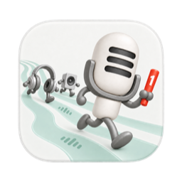
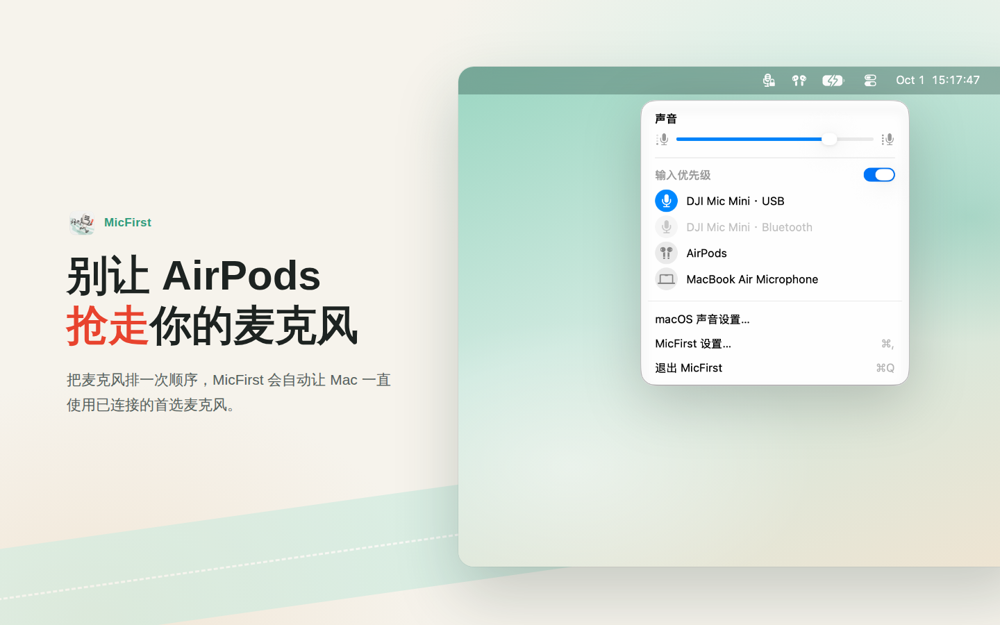
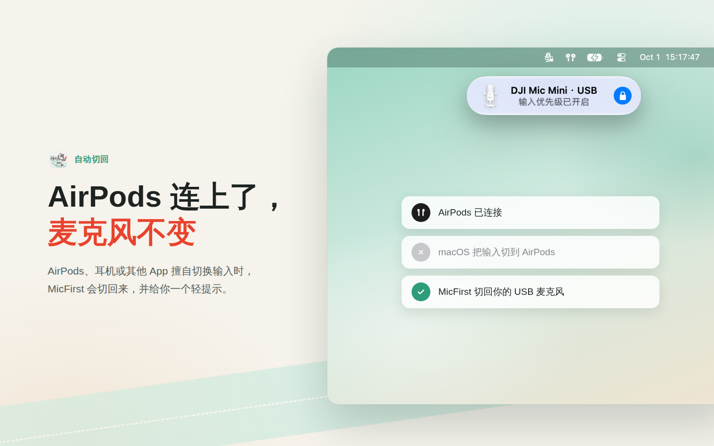
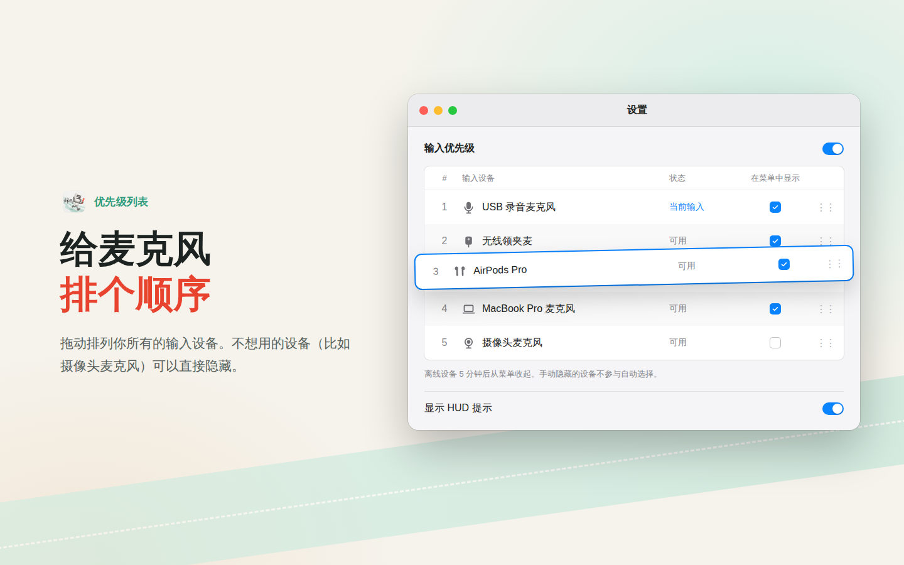
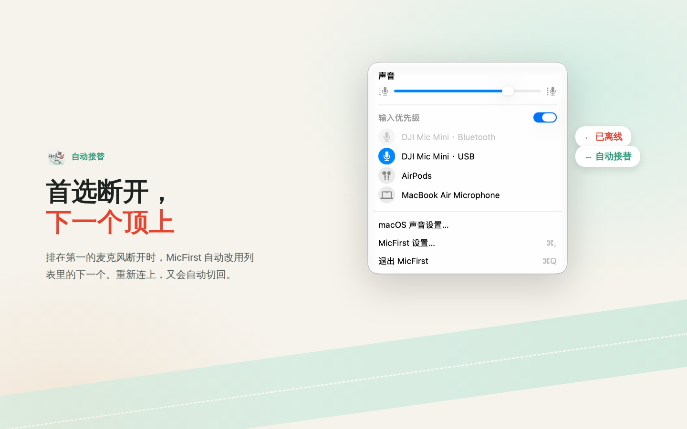

# MicFirst

<p align="center">
  
</p>

<p align="center">
  <a href="https://apps.apple.com/cn/app/micfirst/id6814898645?mt=12"></a>
</p>

<p align="center">
  <a href="https://github.com/tungloong/MicFirst/actions/workflows/build.yml"></a>
  <a href="LICENSE"></a>
</p>

[English](README.md) | [简体中文](README_CN.md)

MicFirst 是一个用于管理 macOS 系统默认音频输入设备的小型菜单栏 app。

MicFirst 是围绕麦克风优先级设计的独立产品，源自已经完成开发的单设备锁定工具
[AudioInputLocker](https://github.com/tungloong/AudioInputLocker)。两者拥有各自的交互方式、仓库和发布记录。

macOS 已经有一个原生风格的声音输出菜单，但没有一个同样顺手的麦克风和输入设备菜单。MicFirst 补上了这块空白：它提供一个接近系统声音菜单的输入设备菜单，并按你排列的优先级选择可用麦克风，在 macOS 或其他 app 尝试切走输入设备时自动恢复。

<p align="center">
  
</p>

<p align="center">
  
</p>

<p align="center">
  
</p>

<p align="center">
  
</p>

## 当前状态与安装

MicFirst 1.0.0 有两种安装方式：

- **Mac App Store**：从 [App Store 页面](https://apps.apple.com/cn/app/micfirst/id6814898645?mt=12) 安装。
- **直接下载**：从 [MicFirst Releases](https://github.com/tungloong/MicFirst/releases/latest) 下载 DMG，打开后把 MicFirst 拖进“应用程序”。
  通用版本同时支持 Apple 芯片和 Intel，已用 Developer ID 签名并通过 Apple 公证。直接下载版不会自动更新，新版本请留意 Releases。

两个版本是同一个 app，Bundle ID 和设置都相同，只需安装其中一个。

源码使用 MIT License 发布，也可以按本页说明从源码构建运行。
AudioInputLocker 的现有下载属于它自己的产品。

## 功能

- 原生 macOS 风格的菜单栏声音输入弹窗。
- 列出 Core Audio 输入设备。
- 可以从菜单直接切换系统默认输入设备。
- 当设备暴露可写输入音量时，显示并控制输入音量。
- 自动选择优先级最高的可用设备，并在外部抢占后恢复。
- 永久记住识别过的设备及其排序，支持拖动在线和离线设备。
- 悬停设备列表时统一显示拖动柄；离线 5 分钟后从菜单收起。
- 设置窗口保留带优先级序号的完整列表，支持排序、隐藏和删除离线设备。
- 手动隐藏的设备不参与自动选择。
- 手动选择其他设备会关闭自动模式，同时保留排序。
- 确认自动恢复成功后显示短暂 HUD，定位在 MicFirst 自己的菜单栏图标下方；屏幕上有系统的 AirPods、音量或亮度横幅时会自动让到旁边。可在设置中关闭。
- 支持英文和简体中文，并跟随系统语言。

## 系统要求

- 运行环境：macOS 13.0 或更新版本。
- 构建环境：带 macOS 26 SDK 的 Xcode。

App 的部署目标是 macOS 13.0。HUD 会在可用时使用公开的 macOS 26 Liquid Glass API，并在旧系统上使用回退实现。

## 构建与运行

克隆仓库：

```sh
git clone https://github.com/tungloong/MicFirst.git
cd MicFirst
```

使用本地辅助脚本：

```sh
./scripts/build-and-run.sh
```

这个脚本会构建 Debug app，停止正在运行的 `MicFirst` 和 `AudioInputLocker` 进程，然后从 `build/DerivedData` 打开新构建的 MicFirst app。

HUD 直接根据 MicFirst 自己的菜单栏图标定位。HUD 显示期间，它会读取公开的窗口元数据，找到系统的 AirPods、音量和亮度横幅并让开位置。这不需要任何权限，Debug 和正式发布的构建行为一致。详见 [HUD 行为与限制](docs/input-priority.md)。

手动构建：

```sh
xcodebuild \
  -project MicFirst.xcodeproj \
  -scheme MicFirst \
  -configuration Debug \
  -destination 'platform=macOS,arch=arm64' \
  -derivedDataPath build/DerivedData \
  build
```

如果不是 Apple Silicon 目标，可以在运行脚本时覆盖 `DESTINATION`。

## 使用方式

1. 点击菜单栏里的麦克风图标。
2. 拖动设备排列优先级，例如 DJI USB → DJI 蓝牙 → AirPods → 内置麦克风。
3. 打开 **输入优先级** 总开关，App 会立即选择排在最前且在线的设备。

设备需要先被 App 识别一次，之后会一直保留在列表中。新发现的设备追加到末尾。
鼠标移入设备列表时，右侧拖动柄会一并显示。离线设备先显示为灰色，5 分钟后从菜单收起，重连后自动恢复。

打开 **MicFirst 设置…**（⌘,）可以管理带优先级序号的完整列表，包括离线设备。
拖动可调整排序；取消在线设备的 **在菜单中显示** 后，它也不再参与自动选择，但保留排序。
离线设备右侧的垃圾桶按钮可以删除记录，下次发现时重新追加到末尾。
**macOS 声音设置…** 打开 macOS 声音设置；**退出 MicFirst**（⌘Q）退出 App。

点击其他在线设备会关闭自动模式，但不会改变排序；点击当前设备不会关闭开关。
再次打开开关，立即恢复最高优先级的可用设备。没有暂停倒计时，也不会定时重新开启。
自动模式开启时，外部抢占会被恢复。所有设备都离线时，开关保持开启并等待设备重新连接。

首次安装会默认开启自动模式，并把当前系统输入设备放在首位。MicFirst 不读取 AudioInputLocker 的配置。

## 本地化

App 当前包含：

- 英文：`MicFirst/en.lproj/Localizable.strings`
- 简体中文：`MicFirst/zh-Hans.lproj/Localizable.strings`

设备名称来自 Core Audio。同名的 USB 和蓝牙设备会附加连接方式，方便区分。

## 项目结构

- `MicFirst/MicFirstApp.swift`：app 入口和菜单栏 extra。
- `MicFirst/SoundMenuView.swift`：声音风格的菜单弹窗。
- `MicFirst/AudioInputViewModel.swift`：输入切换、音量和恢复确认。
- `MicFirst/InputPriorityStore.swift`：优先级持久化、设备记忆和旧版迁移。
- `MicFirst/PreferredInputHUD.swift`：恢复 HUD。
- `MicFirstTests/InputPriorityTests.swift`：优先级与设备切换回归测试。
- `docs/input-priority.md`：行为规则、测试方式和设计稿链接。
- `MicFirst/CoreAudioInputManager.swift`：Core Audio 封装。
- `MicFirst/InputDevice.swift`：输入设备模型和图标推断逻辑。
- `MicFirst/HUDMicrophone.png`：HUD 麦克风资源。
- `MicFirst/Assets.xcassets`：app 图标和菜单栏图标资源目录。
- `scripts/build-and-run.sh`：本地构建和重启辅助脚本。
- `scripts/package-preview-release.sh`：本地 preview release 打包辅助脚本。
- `docs/visual-assets.md`：图标资源和视觉说明。
- `docs/troubleshooting.md`：FAQ 和故障排查说明。
- `docs/github-release.md`：GitHub 仓库设置说明。
- `docs/app-store`：App Store metadata、隐私政策和发布检查清单。
- `docs/product-decisions.md`：产品边界和带日期的决策。
- `docs/liquid-glass-investigation.md`：HUD 视觉实验的历史记录。
- `docs/project-notes.md`：保留供参考的 AudioInputLocker 历史背景。
- `CHANGELOG.md`：项目重要变更记录。
- `CODE_OF_CONDUCT.md`、`CONTRIBUTING.md`、`SUPPORT.md` 和 `SECURITY.md`：社区、贡献、支持和安全说明。

## 实现说明

MicFirst 使用 SwiftUI、AppKit 和 Core Audio 构建。

- app 是菜单栏工具，并通过 `LSUIElement` 隐藏 Dock 图标。
- Core Audio 用于设备枚举、默认输入切换、输入音量读写和设备变化监听。
- 设备排序、已记住的设备信息和自动模式开关保存在本地 `UserDefaults`。
- Mac App Store 版和直接下载版都启用了 App Sandbox。
- HUD 使用无边框 `NSWindow`，位于普通弹出菜单之上，不获取 key/main 焦点。macOS 26+ 使用无 tint 的 clear 玻璃，底下叠加 0.80 不透明度的 Popover 材质以改善可读性。
- HUD 显示期间会读取屏幕上窗口的位置、所属进程和层级，用来找到系统横幅。不读取窗口标题或画面，也不保存任何内容。
- app 不使用私有 API。

## 隐私

MicFirst 只在你的 Mac 本地工作。它不包含分析统计、网络请求、账号系统或遥测。

app 在本地保存设备标识符、名称、图标、连接类型、排序和自动模式开关。详见
[MicFirst 隐私政策](docs/privacy.md)。

## 常见问题

### MicFirst 会录音吗？

不会。MicFirst 不会录制、处理、上传或分析麦克风音频。它只通过 Core Audio 管理系统选中的输入设备。

### 为什么某些设备没有音量滑杆？

有些输入设备没有通过 Core Audio 暴露可写的输入音量控制。只有 macOS 报告该设备支持时，MicFirst 才会启用滑杆。

### 输入优先级支持 AirPods 和 USB 麦克风吗？

这是它主要想解决的场景。MicFirst 始终选择优先级最高的可用设备，其他进程改变默认输入时会自动恢复。实际表现仍可能受设备固件和 macOS 路由规则影响。

### app 需要麦克风权限吗？

app 不录音，因此正常情况下不需要请求麦克风录制权限。

更多说明见 `docs/troubleshooting.md`。

## Roadmap

- 在 preview 脚本之外继续补齐发布打包和上传自动化。

2026 年 9 月 7 日决定：短期不探索多麦混音与融合。详见[产品决策](docs/product-decisions.md)。

## 贡献

欢迎 issue 和 pull request。请保持改动聚焦，并尽量保留菜单和 HUD 的原生 macOS 质感。项目约定见 `CODE_OF_CONDUCT.md`、`CONTRIBUTING.md`、`SUPPORT.md` 和 `SECURITY.md`。

提交 pull request 前，建议先运行：

```sh
./scripts/build-and-run.sh
```

如果改动影响输入优先级，也请至少测试一个真实设备切换场景，例如 AirPods 自动切换、系统设置切换或 USB 麦克风重连。

## 许可证

MicFirst 使用 MIT License 发布。详见 `LICENSE`。
