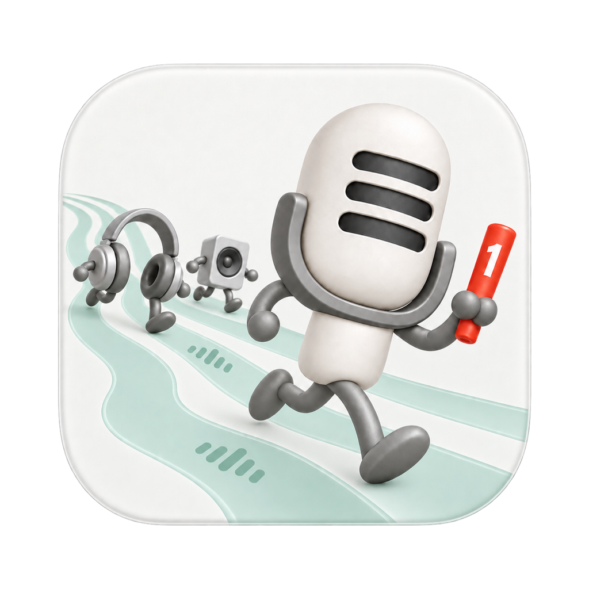

# MicFirst App icon · 瓷白声浪 · 均衡器版

2026-09-21 本地图标交付。用户认可第八轮并要求继续，正式 AppIcon 已替换。此目录的 1.0 表示当前图标交付版本，不代表已发布应用二进制。

## Deliverables

- [MicFirst-1.0-1024.png](MicFirst-1.0-1024.png)：1024 × 1024、sRGB、RGBA 正式主图。
- [MicFirst.icns](MicFirst.icns)：由全部 macOS AppIcon PNG 槽位打包的独立图标。
- [preview.html](preview.html)：浅深背景和实际导出尺寸预览。
- [export-report.json](export-report.json)：来源 SHA-256、实际边界、alpha 规范化与导出参数。
- [asset-validation.json](asset-validation.json)：各资源检查与构建结果。
- [原始候选与提示词](../../2026-09-21-porcelain-equalizer/README.md)：保留完整设计来源。

## Production Processing

使用 `swift scripts/export-app-icon.swift` 可在 macOS 从仓库根目录重复生成。无需 Python 依赖；使用系统 Core Graphics、ImageIO 和 iconutil。

保留批准画面，仅处理 alpha 和尺寸：alpha ≤ 8 的外缘碎屑归零，alpha ≥ 240 的内部恢复 255，中间范围保留平滑过渡；对应修正预乘 RGB，避免变暗。根据实际 alpha 边界 `(108, 122, 1144, 1132)` 取出底板，保持长宽比，将最长边规范为 1024 画布上的 824px，并居中。正式主图非透明边界为 `(100, 110, 924, 914)`，四边及四角全透明。

全部 10 个 `AppIcon.appiconset` 槽位直接从规范化原图导出，覆盖 16/32/64/128/256/512/1024 实际像素；未另行改变小尺寸构图。中英文 README 使用新的 `docs/assets/micfirst-app-icon-256.png`，1024 文档主图与发布主图及 AppIcon 的 1024 槽位字节一致。仅保留仍被历史页面引用的旧 AudioInputLocker 256px 图像。

## Validation

- 全部 10 个 PNG 槽位尺寸、RGBA、四边/四角透明和中心不透明检查通过。
- 相同像素尺寸的重复槽位一致；重复运行导出脚本产物字节一致。
- 浅色、深色背景以及 128/64/32/16px 实际资源完成浏览器检查。16/32px 主要保留麦克风轮廓和红色点，配角、均衡器和数字细节不保证可辨；菜单栏继续使用独立单色图标。
- `./scripts/build-and-run.sh --preview` 通过，Debug App 已使用隔离模拟设备模式启动，退出码 0。
- Universal Release（arm64 + x86_64）构建通过，无编译警告；`LSMinimumSystemVersion` 仍为 `13.0`。本机使用 Xcode 27 / macOS 27 SDK，并非在真实 macOS 13 上运行验证。
- 编译后 `Assets.car` 确认包含全部 10 个 AppIcon 项，像素尺寸与源资源相符；Info.plist 正确指向 AppIcon。
- `iconutil` 从编译后的兼容 ICNS 提取四个旧格式表示，其中 32/128/256px 与源 PNG 像素一致。16px 的 alpha 和完全不透明像素一致，部分透明像素的 RGB 在提取后有差异，详细记录保留在验证 JSON 中；不把该步骤误报为全部尺寸逐像素一致。
- 本轮只改图标与文档，没有修改 Swift 应用功能或菜单栏资源，因此未重复运行音频路由回归测试。

本地构建日志保存在忽略的 `build/icon-debug-preview.log` 和 `build/icon-release.log`。应用二进制的签名公证和发布不在本次图标交付范围内。
