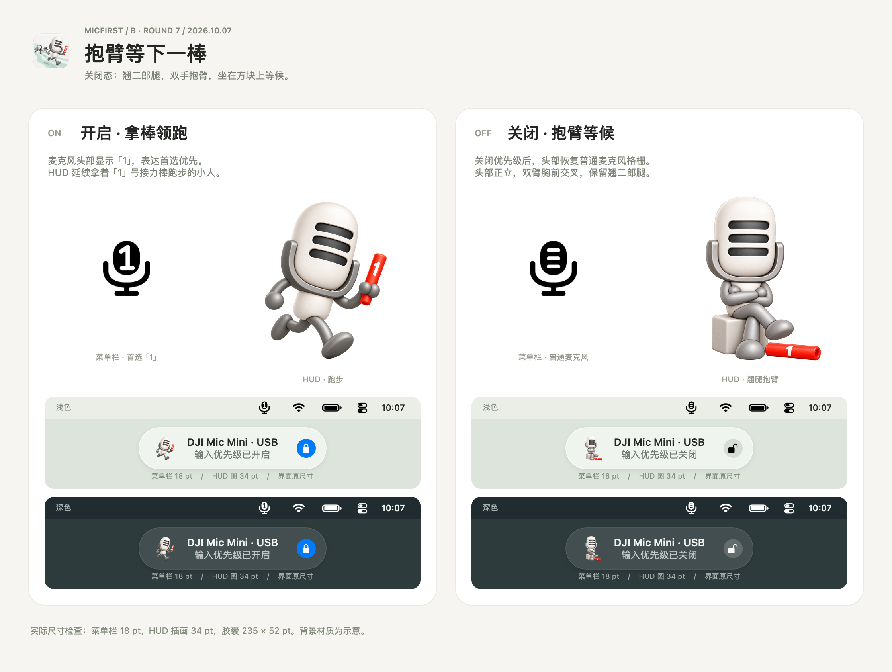

# 第七轮 · 抱臂等下一棒

2026-10-07。按用户本轮要求，关闭态采用翘二郎腿＋双手抱臂。

角色头部正立、身体居中，两臂在胸前交叉，双手靠住对侧上臂；翘二郎腿坐在暖灰方块上。红色「1」号接力棒仍横放在脚边。

- [关闭态透明 PNG](disabled/hud-microphone.png)。
- 使用内置 `image_gen.imagegen`，以第五轮方块坐姿为输入，编辑成胸前抱臂；完整实际提示词见 [disabled/prompt.txt](disabled/prompt.txt)。输出逐字节保留，未使用 CLI / API fallback。
- 开启态和菜单栏继续引用第五轮资源。

运行 `swift docs/design/status-hud/2026-10-07-arms-folded/render-review.swift` 重建 AppKit 离屏对照图。已目视检查双臂交叉、翘腿和浅深背景 34 pt HUD 效果。对照图背景材质为示意。本轮 HUD 已获用户确认（2026-10-07）：开启沿用跑步形象，关闭采用本轮翘腿抱臂。尚未接入应用 target。菜单栏继续另行探索。
