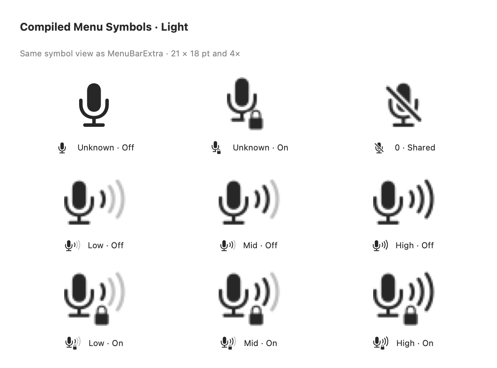
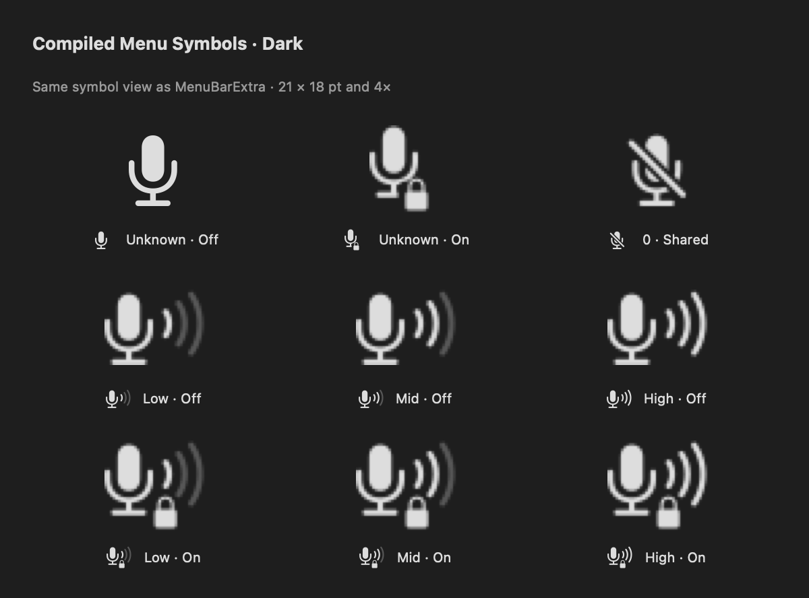

# 原生菜单栏符号接入

2026-10-07，将菜单栏接入系统 SF Symbols 与可变自定义 symbolset。图形沿用 Apple 导出的麦克风、声波、锁路径；只进行平移和等比缩放，锁徽章使用 clear-behind 透明层留出间隙。

## 九态映射

| 输入音量 | 自动优先级关闭 | 自动优先级开启 | Variable Value |
| --- | --- | --- | --- |
| 未知／缺失／非有限值／读取失败 | 系统 `mic.fill` | `MenuBarMicrophoneUnknownLocked` | 无 |
| 已知零 | 系统 `mic.slash.fill` | 同一个系统 `mic.slash.fill`，不带锁 | 无 |
| 大于零、小于 0.34 | `MenuBarMicrophoneVolume` | `MenuBarMicrophoneVolumeLocked` | 0.25 |
| 0.34 至小于 0.68 | 同上 | 同上 | 0.5 |
| 0.68 至 1 | 同上 | 同上 | 1 |

`AudioInputViewModel.currentVolume` 保留 Optional。无当前设备、读取缺失、非有限值和枚举失败均为未知。滑块不能写入时保持禁用；其零占位不参与符号分类。有只读的有效音量时仍能显示相应档位。数据来自 Core Audio 输入音量属性，应用没有采集音频样本。

## 源资源与重建

`scripts/generate-menu-bar-symbols.py` 从 `../2026-10-07-native-eight/originals/` 中的麦克风／声波原件和此目录 `originals/lock.fill.svg` 构建三份主符号与六份独立声波 symbolset；声波 Draw 注解来自 `originals/speaker.wave.3.fill.draw-symbol.svg`。三档可变量采用 0、0.34、0.68 的声波激活阈值；格式为 SF Symbols 7，提供 Ultralight-S、Regular-S、Black-S 三个 master，其余字重由系统插值。

```sh
python3 scripts/generate-menu-bar-symbols.py
./scripts/build-and-run.sh --menu-symbol-review
```

第二条命令启动 Debug 隔离预览，所有设备和偏好均为模拟数据，不写入真实音频路由。按钮覆盖九态和 No Devices；Show Nine States 打开浅色／深色对照。窗口内的 `MicFirstMenuSymbol` 是静态对照，采用 16 pt 字体、small scale 和 21×18 pt 视图画布。macOS 26+ 的实际菜单栏由 `MenuBarSymbolRenderer` 播放动画；请观察屏幕顶部图标。4×图仅便于检查原尺寸栅格，不是动画预览。

## 初始静态资源验证（2026-10-07）





- SF Symbols 应用中三份资源通过验证（均为三份 master，No problems found），证据为 `evidence/sf-symbols-validation.png`、`evidence/sf-symbols-validation-volume.png` 和 `evidence/sf-symbols-validation-unknown-locked.png`。
- Debug 应用使用编译后的 Assets.car 导出九态浅色和深色图；两种外观各有九个不同的 42×36 px 缓冲区（21×18 pt，2×）。低／中／高确为一／二／三条激活声波。单态 PNG 与汇总记录存于 `evidence/`。
- 隔离 UI 实测未知读数和 No Devices 时滑块禁用，未知状态为普通／带锁麦克风；已知零为共用静音。九态按钮均改变实际 `MenuBarExtra` 的公开 `NSStatusBarButton.image`，其图像采用原生符号表示。
- `NSStatusBarButton` 由系统按菜单栏规则布局，不保证遵循 SwiftUI 的 21×18 pt frame。真实按钮图与上述同款视图图分别记录，不能把预览尺寸当作系统按钮尺寸。

再次导出同款视图证据（先构建 Debug）：

```sh
open -n -W build/DerivedData/Build/Products/Debug/MicFirst.app --args \
  --priority-preview --export-menu-symbols \
  "$HOME/Library/Containers/com.tenglong.MicFirst/Data/tmp/MicFirstMenuSymbolReview"
```

导出只缓存 MicFirst 自己的公开视图。按钮捕获位于应用容器的 `Data/tmp/MicFirstMenuSymbolReview/status-button/`，不是宿主 shell 的 `$TMPDIR`。没有使用屏幕录制、辅助功能 API、私有 API 或外部窗口图像。

## 当前动画与验收（2026-10-08）

SwiftUI `MenuBarExtra` 继续管理状态项与菜单。macOS 26+ 的 `MenuBarSymbolRenderer` 在应用自己的 `NSStatusBarButton` 内安装实时 `NSImageView`：底层保留灰色声波，独立声波层播放原生 Draw On／反向 Draw Off；静音、未知和锁状态的主图变化使用 Magic Replace，普通 Replace 作为回退。所有效果统一使用 **0.8 倍速度**。

用户在实际菜单栏中比较了 1、0.7、0.8 倍速度，并于 2026-10-08 认可 0.8 倍。此结论是对当前观感的人工认可，不代表与系统音量菜单的动画逐帧一致。

macOS 26 以下、Reduce Motion 开启时使用静态更新。桥接无法找到按钮时保留 SwiftUI 静态标签。桥接通过公开类型遍历应用自己的窗口视图来定位按钮；SwiftUI 未承诺这一内部视图结构，未来系统版本需要重新验证。菜单点击、高亮和多显示器行为仍需专门验收；不能由动画观感认可推断这些都已通过。macOS 13 尚未真机测试。

### 诊断记录的范围

`evidence/render-validation.json` 保存的是早期 SwiftUI 标签转场不生效时的历史记录。后续 AppKit 桥接的缓存抓帧观察到 Draw 路径中间帧；这些是自有视图缓存渲染，不能读取系统音量图标，也不能代替实际屏幕录像进行时序对照。

普通 `--menu-symbol-review` 不再自动抓帧和写 PNG，避免人工观察时的诊断开销。需要诊断时显式启动：

```sh
open -n build/DerivedData/Build/Products/Debug/MicFirst.app --args \
  --priority-preview --menu-symbol-review --capture-menu-symbols
```

旧采样窗口为 31 帧、间隔 20 ms、共 600 ms，不能保证覆盖放慢后的整个转场；不能直接据此宣布动画已经结束。
